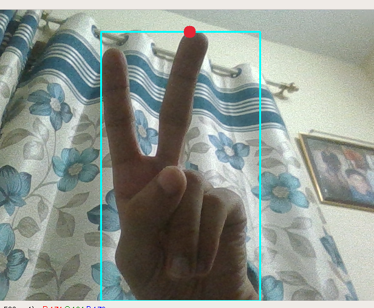
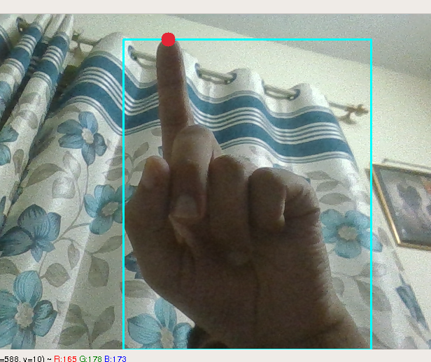

# Hand Gesture Mouse Control

A Deep Learning based attempt at developing a computer vision based software for controlling mouse events like clicks, drags and movement. 

## Requirements

To run this project locally on your system:

- Clone this repository in your system
- cd into the cloned directory and run ```pip install -r requirements.txt``` in your terminal
- Run main.py file using ```python3 main.py```

## Usage

- Gesture: Zero => Action: Drag
- Gesture: Two => Action: Left Click
- Gesture: One (or any other) => Move Pointer






**Note:** The hand detection works on skin detection. Thus, any background noise should be avoided.

## Tech Stack

Some important packages or modules used in the project:
- Keras
- OpenCV
- PyAutoGui
- Pillow

## Dataset

Can be downloaded from [here](https://www.kaggle.com/muhammadkhalid/sign-language-for-numbers)

## Scope of Improvement

There is a lot of scope for improvement like:
- Smooth movement
- More accurate detection of gestures
- Add more functionalities of mouse events
- Hand detection in various lighting environments

Any suggestions, ideas or contributions are welcomed.